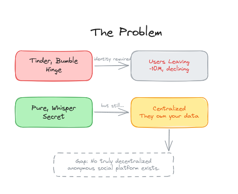
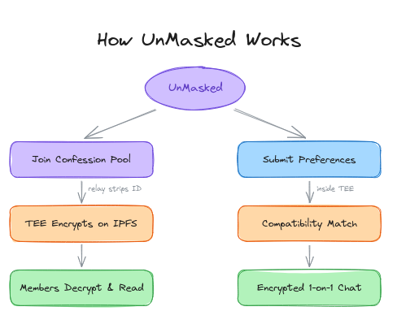
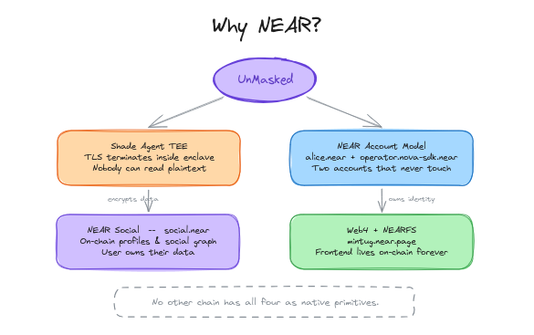
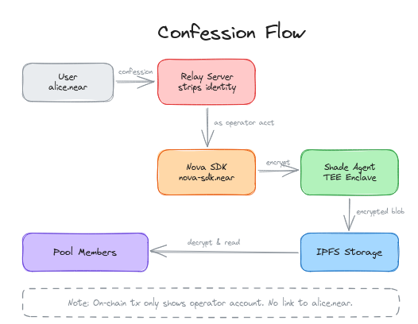
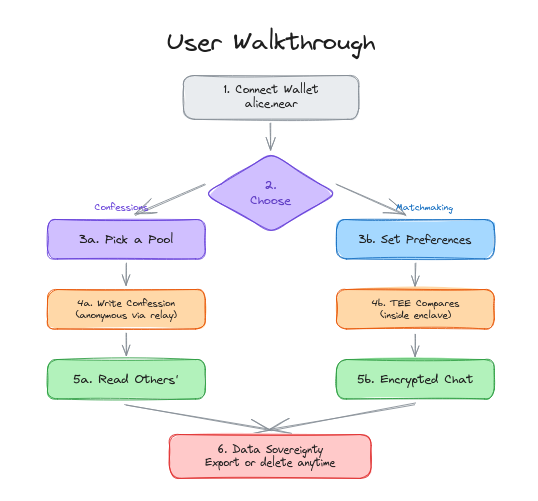

# UnMasked


**Anonymous confessions & confidential matchmaking on NEAR Protocol.**

Live at [mintug.near.page](https://mintug.near.page) (deployed on mainnet)

---

## The Problem

Dating apps like Tinder, Bumble, and Hinge are bleeding users — down 10M+ and declining. They demand real identity upfront. Meanwhile, anonymous platforms like Pure, Whisper, and Secret are growing fast. But they're all centralized — they own your data, sell your secrets, and can be shut down overnight.

No truly decentralized anonymous social platform exists. Until now.



---

## Our Solution

UnMasked is built on two pillars:

**Anonymous Confessions** — Join themed pools (crypto, dating, campus, work, life). Write confessions that pass through a relay server which strips your identity before uploading. Pool members decrypt and read — nobody knows who wrote what.

**Confidential Matchmaking** — Submit encrypted preferences into a TEE (Trusted Execution Environment). The enclave compares compatibility without exposing raw data. Matches unlock private, end-to-end encrypted chat channels.



---

## Why NEAR?

UnMasked can only exist on NEAR. Here's why:

**Nova SDK + Shade Agent TEE** — This is the core. Every confession, every preference, every chat message is encrypted inside a Shade Agent running in a Trusted Execution Environment. The TEE terminates TLS inside the enclave — not even the cloud provider, not the operator, not NEAR itself can read the plaintext. Confessions are encrypted at rest on IPFS, and only pool members with TEE-issued keys can decrypt them. This is verified confidentiality, not a promise.

**NEAR Account Model** — NEAR's named accounts (`alice.near`, `mintug.nova-sdk.near`) are what make our two-account anonymity model work. The user wallet and the operator account are separate named accounts that never interact on-chain. This separation is native to NEAR — no other chain gives you human-readable hierarchical accounts where a sub-account (`mintug.nova-sdk.near`) can act as an independent operator without revealing who triggered the action.

**NEAR Social** — The `social.near` contract is a decentralized key-value store indexed by account ID. We use it for on-chain profiles — display names, avatars, bios — without any centralized database. Users own their identity data and can update or delete it directly on-chain. Combined with `near-social-js`, we tap into NEAR's existing social graph for real distribution.

**Web4 + NEARFS** — The entire frontend is hosted on-chain via NEARFS at `mintug.near.page`. Zero centralized servers. The web4 contract handles SPA routing natively. If our team disappears tomorrow, the app keeps running.

No other chain has Shade Agent TEEs, named accounts, an on-chain social layer, and decentralized frontend hosting as native primitives. NEAR has all four.



---

## Privacy by Default

Anonymity isn't a setting you toggle on — it's the architecture. Confessions are anonymous because the relay strips identity and the TEE encrypts before storage. Matchmaking is confidential because raw preferences never leave the enclave. Users can inspect, export, and permanently delete all their data at any time.

Every encryption operation runs inside a Shade Agent TEE with cryptographic attestation. This isn't "we promise not to look" — it's "we mathematically cannot look."

---

## Technical Architecture

The core anonymity guarantee comes from account separation:

- **User wallet** (`alice.near`) — connects in the app, joins pools, reads confessions.
- **Operator account** (`mintug.nova-sdk.near`) — server-side only. Posts confessions on behalf of users.

These two accounts never touch on-chain. When alice writes a confession, the relay strips her identity and uploads it as the operator. On NearBlocks, the transaction only shows the operator account. There is no link back to alice.



---

## User Walkthrough

1. **Connect Wallet** — Sign in with your NEAR account via Meteor or MyNearWallet.
2. **Choose** — Confessions or Matchmaking.
3. **Confessions** — Pick a pool, write anonymously, read others' secrets.
4. **Matchmaking** — Set preferences, TEE compares inside an enclave, get matched.
5. **Chat** — Matched users communicate through encrypted Nova group channels.
6. **Data Sovereignty** — Export your data as JSON or permanently delete your account.



---


## Setup

### Prerequisites

- Node.js 18+
- pnpm

### Environment Variables

```
VITE_NOVA_API_KEY=<your-nova-api-key>
VITE_NOVA_OPERATOR=<your-account>.nova-sdk.near
VITE_MOCK_MODE=true
```

Set `MOCK_MODE=false` to use the real Nova SDK instead of the in-memory mock.

### Run Locally

```bash
pnpm install
pnpm dev
```

Runs on `http://localhost:5173`.

---

## License

MIT
